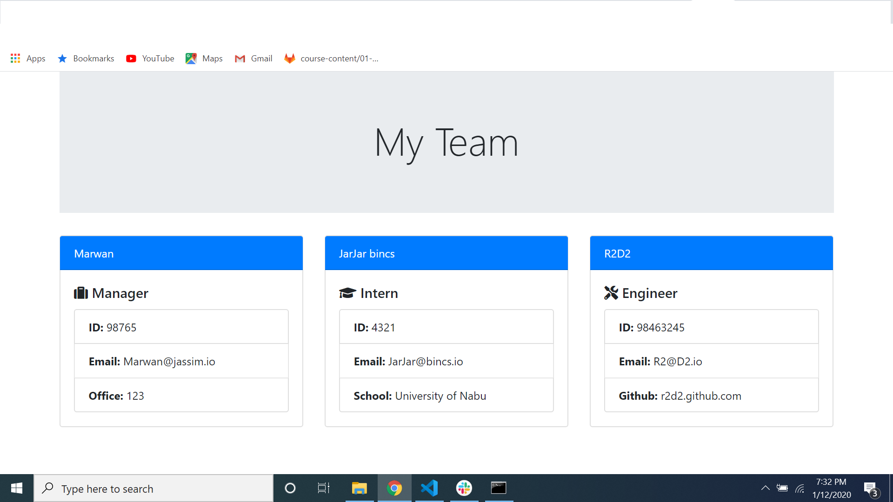

My Emoplyee Summary will allow managers, to track their employees more effectivly and efficintly it will show the employees info, 
# images

# Built With
Node.js
JavaScript
NPM (you requier to install npm to run this app)
And any browser to prject results

# Authors
Marwan Jassim

# License
This project is licensed under the MIT License
git@github.com:marwanjassim/Employee-summary.git
https://github.com/marwanjassim/Employee-summary
https://www.linkedin.com/in/marwan-jassim-b3001878/
https://marwanjassim.github.io/Employee-summary/

# snipets
{
            type: 'input',
            name: 'managerName',
            message: "What is the manager's name?"
        },
{
            type: 'number',
            name: 'numInterns',
            message: "How many interns are there?"
        },        